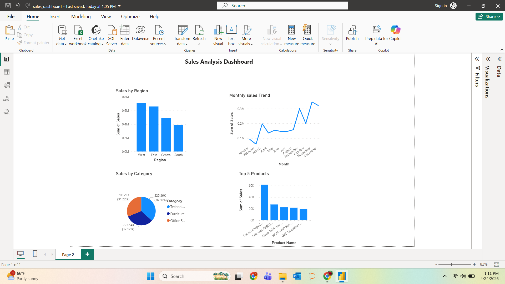

# Sales Data Analysis Dashboard

## 📌 Project Overview

This project analyzes retail sales data to uncover insights on regional performance, product trends, and category-level sales. The workflow includes data cleaning, analysis using Python, and visualization using Power BI.

---

## 🎯 Objectives

* Clean and preprocess raw sales data using Python
* Perform exploratory data analysis (EDA)
* Identify trends and top-performing regions/products
* Build an interactive Power BI dashboard

---

## 🛠️ Tools & Technologies

* Python (Pandas, Jupyter Notebook)
* SQL (basic analysis)
* Power BI (dashboard creation)

---

## 📊 Project Workflow

1. **Data Cleaning & Preparation**

   * Handled missing values and formatted date columns using Pandas
   * Processed 9,700+ records for analysis

2. **Exploratory Data Analysis (Python)**

   * Calculated total sales, analyzed regional performance, and identified top products
   * Generated monthly sales trends

3. **Dashboard Creation (Power BI)**

   * Built interactive visuals:

     * Sales by Region
     * Monthly Sales Trend
     * Sales by Category
     * Top 5 Products

---

## 📈 Key Insights

* West region contributes ~30% of total sales
* Top 5 products contribute ~40% of total revenue
* Sales increased by ~25% toward the end of the year
* Technology category shows strong performance
* Improved data understanding and decision-making through visual storytelling

---

## 📁 Project Structure

Sales-Data-Analysis/
│
├── data/
│   └── cleaned_sales_data.csv
│
├── dashboard/
│   └── sales_dashboard.pbix
│
├── notebooks/
│   └── data_analysis.ipynb
│
├── screenshots/
│   └── dashboard.png
│
├── README.md

---

## 📷 Dashboard Preview

---
## ▶️ How to Use

1. Open the `.pbix` file in Power BI Desktop  
2. Explore visuals and filters  
3. Use the dataset for further analysis in Python/SQL

## 💼 Resume Description

Built an end-to-end data analysis project by cleaning and analyzing sales data using Python and creating an interactive Power BI dashboard to derive actionable business insights.

---

## 🚀 Future Improvements

* Add advanced SQL queries for deeper analysis
* Include profit and customer segmentation analysis
* Add filters/slicers for dynamic dashboard interaction

